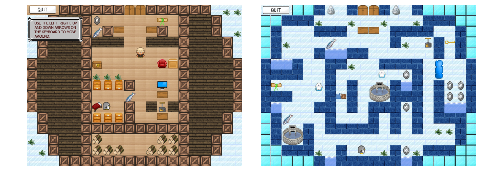

# Ice-Capades-Game

## Overview ##
Ice Capades is a Pokemon-style inspired game that aims to teach players about the affects of climate change on the environment. You must pass through multiple levels, interact with objects, solve puzzles and avoid enemies in order to make your way to the oil rig that is causing the ice in your village to melt.

## Controls ##
Walk. Left, right, up or down arrow keys.
Interact/collect objects. Walk into them.

## Levels ##
Altogether there are 5 levels.

Level 1 - The cottage where you wake up and have the tutorial.

Level 2 - The village outside, where you live.

Level 3 - The forest outside the village (I seemed to have forgotten that Antarctica has no trees...).

Level 4 - The underwater level, where you swim through to get to the oil rig.

Level 5 - The oil rig.

## Controls and Gameplay ##

Action  	  	| Controls
--------------- | -------------
Walk Left 	  	| Left Keyboard arrow or 'A'
Walk Right	  	| Right keyboard arrow or 'D'
Jump		  	| Spacebar
Open/Close Menu | 'M' key
Attack			| 'Z' key
